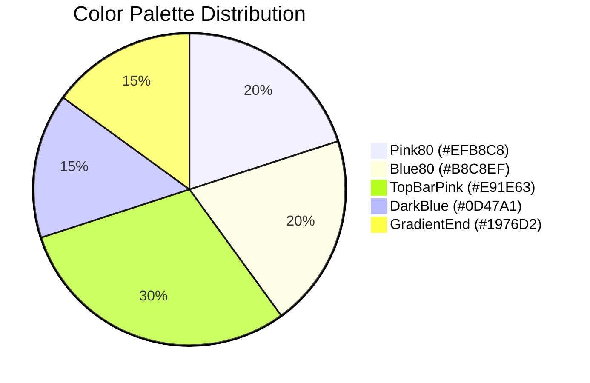
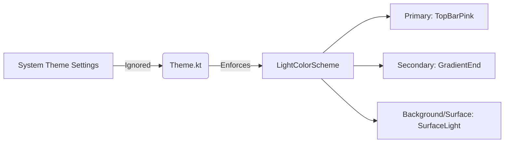

# Color Profiling and Theming

This document details the color palette and theming configuration used in the PCM Player Converter application.

## Core Color Palette

The application enforces a **Light Theme** with a signature pink and blue gradient aesthetic.

## Color Constants (`Color.kt`)

| Color Name | Hex Code | Usage |
| :--- | :--- | :--- |
| `Pink80` | `#EFB8C8` | Tertiary color accents. |
| `Blue80` | `#B8C8EF` | Light blue complementing `Pink80`. |
| `GradientStart` | `#C2185B` | Starting color for standard gradients (Darker Pink). |
| `GradientEnd` | `#1976D2` | Ending color for standard gradients, Secondary color (Darker Blue). |
| `TopBarPink` | `#E91E63` | Primary color, used heavily in the TopAppBar. |
| `DarkBlue` | `#0D47A1` | Used for borders and text labels for high contrast. |
| `ButtonText` | `#FFFFFF` | Standard white for text on colored buttons. |
| `SurfaceLight` | `#FDFDFD` | Background and Surface color for the light theme. |

## Theme Configuration (`Theme.kt`)

The application intentionally overrides system dark mode settings to enforce the brand's aesthetic. Dynamic colors (Material You) are disabled to maintain the gradient branding.

