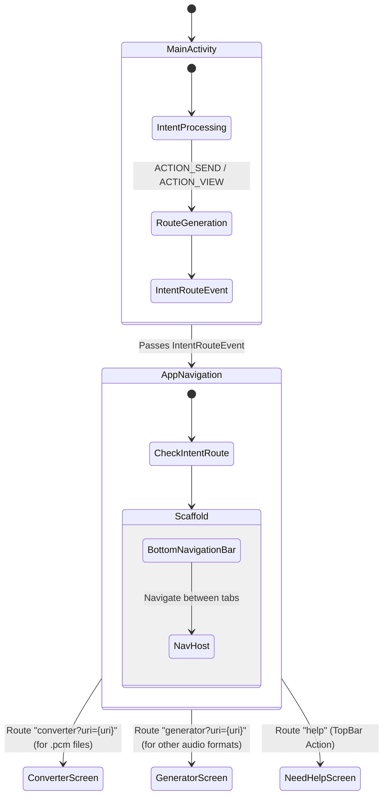
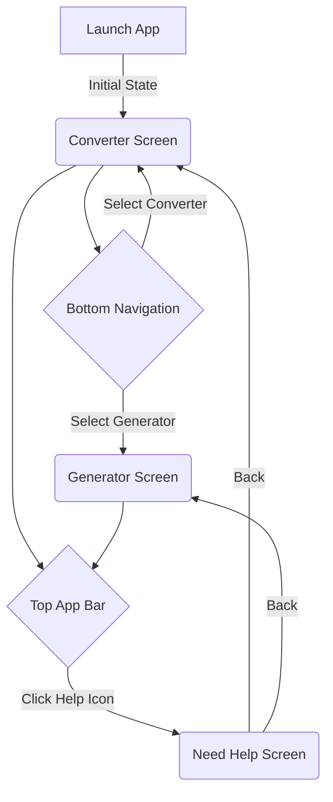

# Navigation Map

This document outlines the navigation flow of the PCM Player Converter application, built using Jetpack Compose Navigation.

## Intent Routing Architecture

The application intercepts external intents and routes them to specific screens based on the file type.

## Screen Flow

## Global UI Components

- **AudioPlayerSheet**: Acts as a global modal overlay dialog that can be triggered from anywhere via the `MainViewModel`. When `isPlayerVisible` is true, the `AudioPlayerSheet` appears over the current screen.
- **PromoBanner**: A dismissable "Try Color Shift" card rendered above the `NavHost`, so it appears on both tabs (never on the Help screen). Visibility is decided by `PromoViewModel` / `PromoCapPolicy`, and re-evaluated on every `ON_RESUME`, for example after returning from the Play Store.

## Cold-start intent handling

When the app is launched *by* a Share/Open-with intent, the `IntentRouteEvent` can arrive before `NavHost` has set its graph. `AppNavigation` waits for the first back-stack entry (`currentBackStackEntryFlow.first()`) before navigating, so the shared file is not dropped.

## Screen analytics

`AppNavigation` registers a `NavController.OnDestinationChangedListener` that logs a `screen_view` for `converter`, `generator` and `help`; the player dialog and settings dialog log `player` / `settings` when opened.
