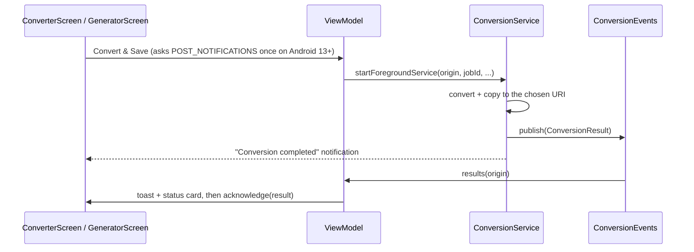

# Technical Architecture

This document breaks down the technical architecture, packages, and core layers of the PCM Player Converter application.

## High-Level Architecture

The application follows the **Model-View-ViewModel (MVVM)** architectural pattern combined with **Clean Architecture** principles.

```mermaid
graph TD
    UI[UI Layer (Jetpack Compose)] --> VM[Presentation Layer (ViewModels)]
    VM --> UC[Domain Layer (Use Cases)]
    UC --> Repo[Domain Repository Interface]
    Repo --> RepoImpl[Data Layer (Repository Implementation)]
    RepoImpl --> Local[Local Data Source / File System]
    RepoImpl --> Service[Conversion Foreground Service]
```

## Layer Breakdown

### 1. UI Layer (`com.rajatnagpure.pcmplayerconverter.ui`)
Built entirely using **Jetpack Compose**.
- **Screens**: `ConverterScreen`, `GeneratorScreen`, `NeedHelpScreen`.
- **Navigation**: `AppNavigation` manages routing and deep-link intent handling.
- **Components**: Reusable UI elements (`AppButton`, `NeuCard`, `AudioConfigSelector`, `AppDialog`, `AudioPlayerSheet`, `PromoBanner`).

### 2. Presentation Layer (`com.rajatnagpure.pcmplayerconverter.ui.viewmodel`)
State holders that manage the UI state and handle user interactions.
- **`MainViewModel`**: Manages global state such as the active media player visibility, current playing file, and playback progress.
- **`ConverterViewModel`**: Manages the state for converting standard audio files (WAV, MP3, etc.) to raw PCM format.
- **`GeneratorViewModel`**: Manages the state for generating/recording PCM audio and configuring audio parameters (Sample Rate, Channels, Encoding).
- **`PromoViewModel`**: Decides whether the Color Shift cross-promo banner is shown (see *Cross-promo banner* below).

### 3. Domain Layer (`com.rajatnagpure.pcmplayerconverter.domain`)
Contains the core business logic.
- **Models**: `AudioConfig` representing the format configurations.
- **Repository Interface**: `AudioRepository` defines the contract for audio operations.
- **Use Cases**: `ConvertPcmUseCase` encapsulates the logic to execute a conversion job.
- **`promo/PromoCapPolicy`**: Pure frequency-capping rules for the promo banner (unit-tested).

### 4. Data & Service Layer (`com.rajatnagpure.pcmplayerconverter.data` / `.service`)
Handles actual data processing, hardware interaction, and background execution.
- **`AudioRepositoryImpl`**: Concrete implementation of the data operations.
- **`LocalFileDataSource`**: Manages file read/write operations.
- **`PcmPlayer` & `PcmRecorder`**: Interfaces directly with Android's `AudioTrack` and `AudioRecord` APIs to play and capture raw audio bytes.
- **`PcmConverter`, `AudioEncoder`, `AudioDecoder`**: Low-level utility classes responsible for decoding compressed audio formats to PCM and encoding PCM back to WAV/compressed formats using `MediaCodec` and `MediaExtractor`.
- **`ConversionService`**: An Android Foreground Service (`foregroundServiceType="dataSync"`) that ensures long-running conversions continue even if the user minimizes the app.
- **`ConversionEvents`**: `@Singleton` in-process bus that carries each job's result to the screen that started it (see below).
- **`ConversionNotifications`**: Builds the silent "Converting…" progress notification and the "Conversion completed / failed" result notification.
- **`PromoRepository`, `RemoteConfigRepository`**: Promo history in SharedPreferences and Firebase Remote Config values.

## Dependency Injection

The project uses **Hilt** for dependency injection.
- **`AppModule`**: Provides instances of `AudioRepository`, `LocalFileDataSource`, etc., scoped appropriately (usually `@Singleton` for repositories).
- **`BaseApplication`**: Annotated with `@HiltAndroidApp` to bootstrap the DI graph.
- **`AnalyticsModule`**: Binds `AnalyticsTracker` → `FirebaseAnalyticsTracker`.

## Conversion result flow



Results are held in `ConversionEvents` until the owning ViewModel acknowledges them. This means a result that lands while the screen is being recreated is still shown, and a Converter job never shows up on the Generator tab (or the reverse).

## Analytics (Firebase)

- **`analytics/AnalyticsTracker`**: the interface every ViewModel and service uses. Tests use `FakeAnalyticsTracker`.
- **`analytics/FirebaseAnalyticsTracker`**: the implementation backed by Firebase Analytics and Crashlytics. It does nothing when `google-services.json` was missing at build time.
- **`analytics/AnalyticsEvents`**: every event, parameter and user-property name, plus helpers (`sizeBucket`, `extensionOf`) that keep personal data out of events.
- **Collection rules:**
  - The user can turn collection off in **Settings → Privacy**.
  - Debug builds don't collect unless built with `-PanalyticsInDebug=true` (`BuildConfig.ANALYTICS_ENABLED`).
- **Screen tracking:** done manually through a `NavController` destination listener in `AppNavigation`. Firebase's automatic screen tracking only sees Activities, and Compose screens aren't Activities.

The event catalog and the console setup are documented in [FIREBASE_SETUP.md](FIREBASE_SETUP.md).

## Cross-promo banner

`PromoBanner` (Color Shift, package `com.rajatnagpure.floodfill`) sits above the `NavHost`. It's capped on **dismissals only**. There's no impression limit, and tapping Play only opens the store. `PromoCapPolicy` decides when it may show:
1. Remote Config can switch it off.
2. It never shows once Color Shift is installed. This is re-checked on every resume, so it disappears when the user returns from the Play Store with the game installed.
3. It doesn't show on the first launch (`promo_min_sessions`).
4. After a ✕ tap it comes back after 4 days.
5. While 2 ✕ taps fall within the last 14 days, it stays hidden. It returns once the older tap leaves that rolling window.

Otherwise it shows on every launch until the user taps ✕ or installs the game. `promo_impression` is logged once per launch that shows it.

**Link and attribution.** Tapping the card or **Play** opens `AppConfig.COLOR_SHIFT_PLAY_URL` with `PlayStore.openUrl`:

```
https://play.google.com/store/apps/details?id=com.rajatnagpure.floodfill&referrer=utm_source%3Dpcm_player_converter%26utm_medium%3Dcross_promo%26utm_campaign%3Din_app_banner
```

- The URL is opened in the Play Store app (`com.android.vending`) so the `referrer` survives. If Play isn't available, it opens in the browser instead.
- The decoded referrer is `utm_source=pcm_player_converter&utm_medium=cross_promo&utm_campaign=in_app_banner`.
- The Play Store passes the referrer to Color Shift on install, through the Install Referrer API.
- `PlayStoreTest` guards the exact URL.

It also waits while a conversion or recording is running. The thresholds come from Remote Config, with defaults in `res/xml/remote_config_defaults.xml` and `firebase/remoteconfig.template.json`.
